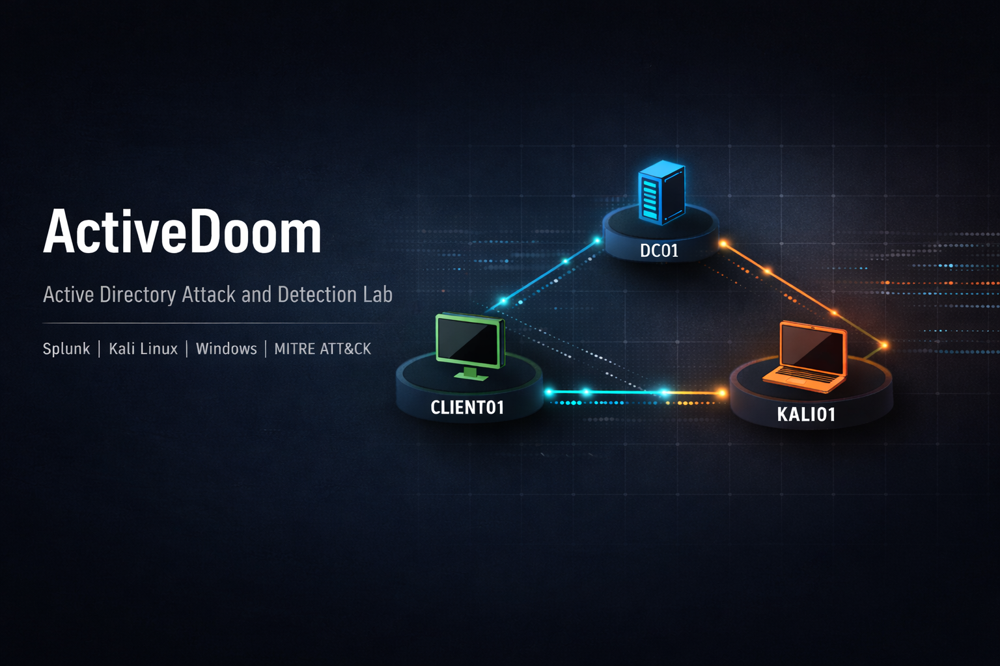

# ActiveDoom: Active Directory Attack and Detection Lab



> A production-style cybersecurity lab project that demonstrates end-to-end Red Team simulation and Blue Team detection engineering using Active Directory, Splunk, Kali Linux, and Windows infrastructure.

##  Project Objective

ActiveDoom is designed to solve a common SOC challenge: many analysts can run detections, but fewer can prove they understand the attacker behavior that generated those signals.  
This project closes that gap by combining:

- Attack simulation in a controlled AD lab
- Security telemetry ingestion into Splunk
- Detection engineering for Windows authentication abuse
- Incident investigation storytelling for portfolio presentation

##  Problem Statement

Security teams frequently miss early-stage credential abuse because authentication events are noisy and often not correlated effectively. ActiveDoom demonstrates how to:

- Generate realistic authentication attack patterns
- Detect failed and successful logon anomalies
- Build reusable SIEM queries and alert logic
- Map telemetry to MITRE ATT&CK for analyst-ready reporting

##  Architecture Overview

### Components

- `DC01` (Domain Controller): Active Directory + security event source
- `CLIENT01` (Domain-joined workstation): user activity + event source
- `KALI01` (Attacker VM): controlled adversary simulation node
- `Splunk Enterprise` (Host): centralized log ingestion, search, dashboarding, alerting

### Network Design

- Platform: VirtualBox host-only lab
- Subnet: `192.168.180.0/24`
- Splunk receiver: `192.168.180.1:9997`
- DC01: `192.168.180.10`
- CLIENT01: `192.168.180.20`
- KALI01: `192.168.180.30`

Detailed diagram and flow: [architecture/lab-diagram.md](architecture/lab-diagram.md)

##  Lab Setup Summary

### Infrastructure Requirements

- Windows host with VirtualBox
- 3 VMs (`DC01`, `CLIENT01`, `KALI01`)
- Splunk Enterprise on host
- Splunk Universal Forwarder on `DC01` and `CLIENT01`

### Host + Splunk Baseline

1. Install Splunk Enterprise on host.
2. Enable receiving on port `9997`.
3. Confirm `8000` (Web) and `8089` (Mgmt API) are reachable.

### VM Baseline

1. Assign static IPs in `192.168.180.0/24`.
2. Set DNS correctly (`CLIENT01` -> `DC01`).
3. Join `CLIENT01` to the AD domain.
4. Run setup scripts from `scripts/setup/`.

Full procedure: [docs/setup-guide.md](docs/setup-guide.md)

##  Attack Scenarios (Red Team Simulation)

### 1) Brute-force Style Failed Login Burst

Script: [scripts/attacks/brute-force.ps1](scripts/attacks/brute-force.ps1)  
Goal: generate repeated failed authentications to produce Event ID `4625`.

Example:

```powershell
.\scripts\attacks\brute-force.ps1 -TargetHost "\\DC01\\IPC$" -DomainUser "corp\Administrator" -Attempts 10
```

### 2) Valid Login Simulation

Script: [scripts/attacks/login-simulation.ps1](scripts/attacks/login-simulation.ps1)  
Goal: generate successful authentications to produce Event ID `4624`.

Example:

```powershell
.\scripts\attacks\login-simulation.ps1 -TargetHost "\\DC01\\IPC$" -DomainUser "corp\Administrator" -Password "Password@1234" -Count 5
```

##  Detection Engineering (Blue Team)

Detection pack: [splunk/queries/detection-queries.spl](splunk/queries/detection-queries.spl)

### Core Detection Logic

- Failed login detection using Event ID `4625`
- Successful login detection using Event ID `4624`
- Brute-force aggregation with threshold logic over time windows

### Example SPL Focus Areas

- `index=main sourcetype=WinEventLog:Security EventCode=4625`
- `index=main sourcetype=WinEventLog:Security EventCode=4624`
- Binned time aggregation and threshold filtering

##  MITRE ATT&CK Mapping

| Technique | Name | Telemetry | Detection Logic |
|---|---|---|---|
| `T1110` | Brute Force | Event ID `4625` | Repeated failed authentication attempts per host/time window |
| `T1078` | Valid Accounts | Event ID `4624` | Successful authentication tracking and account context |

##  Screenshots and Portfolio Evidence

Add the supplied images to [screenshots/README.md](screenshots/README.md) using these filenames:

- `banner-placeholder.png` - README banner image still required
- `architecture-diagram.png` - lab architecture
- `failed-logins-4625.png` - failed login query results
- `success-logins-4624.png` - successful login query results
- `bruteforce-timeline.png` - brute-force aggregation view
- `alert-triggered.png` - alert evidence

## Screenshot Slots

Use these image slots once the files are placed in `screenshots/`:

### Banner


### Architecture


### Failed Login Evidence


### Successful Login Evidence


### Brute Force Detection Timeline


### Alert Evidence


##  Step-by-Step Quick Start

1. Clone repository and open PowerShell as Administrator.
2. Build VMs and apply static IP plan (`192.168.180.0/24`).
3. Run `scripts/setup/DC01-setup.ps1` on `DC01`.
4. Run `scripts/setup/CLIENT01-setup.ps1` on `CLIENT01`.
5. Enable Splunk receiver on `9997`.
6. Validate event ingestion in Splunk.
7. Execute attack simulation scripts.
8. Run SPL detections and document findings.
9. Complete evidence report in [reports/final-report.md](reports/final-report.md).

##  Repository Structure

```text
ActiveDoom/
├── README.md
├── architecture/
│   └── lab-diagram.md
├── scripts/
│   ├── setup/
│   │   ├── DC01-setup.ps1
│   │   └── CLIENT01-setup.ps1
│   └── attacks/
│       ├── brute-force.ps1
│       └── login-simulation.ps1
├── splunk/
│   ├── dashboards/
│   ├── queries/
│   │   └── detection-queries.spl
│   └── alerts/
├── screenshots/
├── docs/
│   ├── setup-guide.md
│   └── troubleshooting.md
├── reports/
│   └── final-report.md
├── DC01-setup.ps1
├── CLIENT01-setup.ps1
└── Host-Setup.txt
```

##  Backward Compatibility Note

Original root setup files are intentionally preserved:

- `DC01-setup.ps1`
- `CLIENT01-setup.ps1`
- `Host-Setup.txt`

This keeps existing functionality intact while introducing a modular production structure.

##  Troubleshooting

See [docs/troubleshooting.md](docs/troubleshooting.md) for:

- Splunk port `9997` issues
- Forwarder service failures
- Missing log ingestion
- Domain join and DNS problems

##  Future Improvements

- AI-assisted SOC workflows for anomaly triage and alert enrichment
- Wazuh integration for host-based detection correlation
- Automated attack replay pipelines for continuous detection testing
- CI-based validation of SPL queries and detection coverage
- Expanded ATT&CK mapping for lateral movement and privilege escalation

##  Professional Positioning

This repository is built to showcase SOC Analyst / Detection Engineer capability across:

- Lab engineering
- Log pipeline validation
- Threat simulation
- Detection content development
- ATT&CK-aligned reporting

## License

MIT License (see [LICENSE](LICENSE)).
