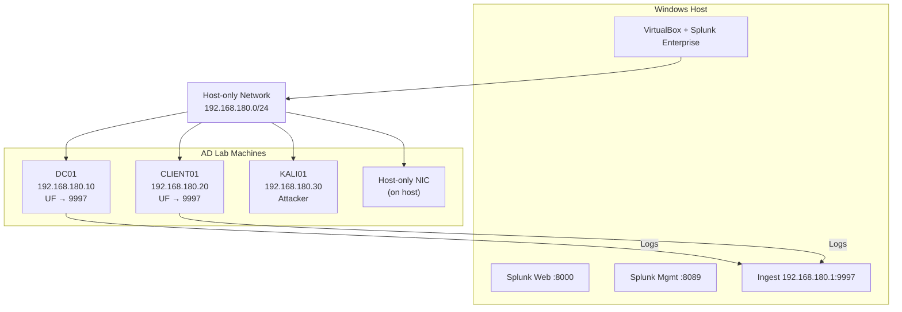

# AD Lab for VirtualBox

This repository provides a repeatable Active Directory detection lab built around VirtualBox VMs, a host-installed Splunk Enterprise instance, and WSL-based tooling. The goal is to keep the lab isolated, easy to rebuild, and predictable for detection engineering, telemetry validation, and controlled attack simulation.

## What This Lab Contains

- Three VirtualBox guests for the Windows AD environment and attacker workstation.
- Splunk Enterprise installed on the Windows host for ingest and search.
- WSL helpers for enumeration and lab activity.
- PowerShell scripts for profile generation, startup, shutdown, and health checks.
- Detection content in Splunk searches, dashboards, and rule notes.

## Current Checked-In Defaults

These are the defaults encoded in `config/lab-profile.psd1` and the orchestration scripts.

|           Setting         |      Value      |
|---------------------------|-----------------
| VM provider               | VirtualBox 
| Attacker VM name          | `KALI01` 
| Domain controller VM name | `DC01` 
| Client VM name            | `CLIENT01`
| Attacker VM IP            | `192.168.180.30` 
| DC IP                     | `192.168.180.10` 
| Client IP                 | `192.168.180.20` 
| Lab subnet                | `192.168.180.0/24`
| VBoxManage path           | `C:\Program Files\Oracle\VirtualBox\VBoxManage.exe` 
| Splunk web URL            | `http://localhost:8000` 
| Splunk API URL            | `https://localhost:8089/services/server/info?output_mode=json` 
| Splunk password           | `Chang3M3Now!` 
| WSL probe command         | `hostname` 
| Startup timeout           | 300 seconds 
| Health retry interval     | 5 seconds 

Important: the checked-in profile names the VMs `DC01` and `CLIENT01`. Add the attacker VM name and IP to the profile before running the lab, and keep the profile, the VirtualBox machine names, and the script defaults aligned.

## Recommended VirtualBox Layout

Use the following settings for each guest unless you have a reason to deviate.

### Host-Level Requirements

- Windows host with VirtualBox installed.
- `VBoxManage.exe` available at the path above or on `PATH`.
- Splunk Enterprise installed on the Windows host.
- WSL enabled for the attack and enumeration side of the lab.
- Enough memory for the full stack; 8 to 10 GB free is a good target.

### Network Design

Use one dedicated host-only network for the lab.

- Network type: Host-only adapter.
- Subnet: `192.168.180.0/24`.
- DHCP: disabled.
- DC static IP: `192.168.180.10`.
- Client static IP: `192.168.180.20`.

Recommended adapter layout:

|  Adapter  |  Purpose  | Notes 
|-----------|-----------|------
| Adapter 1 | NAT       | Optional, only if you want temporary internet access for patching or tooling. 
| Adapter 2 | Host-only | Required for lab traffic and all checks performed by the scripts. 

If you want maximum isolation, disable NAT after patching and package installation are complete.

### VM Hardware Settings

|     Setting     |                 DC01                         | CLIENT01                                     | KALI01 |
|-----------------|----------------------------------------------|----------------------------------------------|
| Guest OS        | Windows Server guest                         | Windows 10/11 guest                          | Kali Linux guest 
| CPU             | 2 vCPU                                       | 2 vCPU                                       | 2 vCPU 
| RAM             | 4096 MB recommended, 2048 MB minimum         | 4096 MB recommended, 2048 MB minimum         | 4096 MB recommended, 2048 MB minimum 
| Disk            | 60 GB dynamic VDI                            | 60 GB dynamic VDI                            | 40 to 60 GB dynamic VDI 
| Firmware        | BIOS or UEFI, keep consistent across all VMs | BIOS or UEFI, keep consistent across all VMs | BIOS or UEFI, keep consistent across all VMs 
| Chipset         | Default VirtualBox chipset                   | Default VirtualBox chipset                   | Default VirtualBox chipset 
| Graphics        | Default or low video memory                  | Default or low video memory                  | Default or low video memory 
| Clipboard       | Disabled or bidirectional during admin work  | Disabled or bidirectional during admin work  | Disabled or bidirectional during admin work 
| Drag and drop   | Disabled                                     | Disabled                                     | Disabled 
| Shared folders  | Off by default                               | Off by default                               | Off by default 
| Audio           | Disabled                                     | Disabled                                     | Disabled 
| USB             | Disabled unless required                     | Disabled unless required                     | Disabled unless required 

### Network Adapter Settings in VirtualBox

For the host-only interface:

- Adapter type: Intel PRO/1000 MT Desktop or the default VirtualBox gigabit adapter.
- Cable connected: enabled.
- Promiscuous mode: deny.
- Attached to: Host-only Adapter.
- Adapter name: your dedicated lab host-only adapter.

For the optional NAT interface:

- Use it only for updates, package installs, or pulling tools.
- Do not rely on it for the lab IPs used by the scripts.

## VM Build Guide

### 1. Create `DC01`

Use a Windows Server ISO and create a new VirtualBox VM with the following baseline:

- Name: `DC01`
- Type: Microsoft Windows
- Version: match your Windows Server media
- Memory: 4 GB recommended
- CPUs: 2
- Disk: 60 GB dynamic VDI
- Network: host-only on `192.168.180.0/24`

After installation:

- Rename the host to `DC01` if it is not already set.
- Assign static IP `192.168.180.10` to the host-only adapter.
- Set the preferred DNS server to itself after AD DS promotion.
- Promote the server to a domain controller.
- Install VirtualBox Guest Additions if you want better integration and cleaner console work.
- Take a clean snapshot after the base build and again after the domain controller is finalized.

Suggested DC settings after promotion:

- DNS points to `192.168.180.10` on the host-only adapter.
- Windows Firewall remains enabled, but allow the traffic you need for AD, SMB, LDAP, Kerberos, and management.
- Time sync should stay stable; the DC should be the authoritative time source for the domain.

### 2. Create `CLIENT01`

Use a Windows 10 or Windows 11 ISO and create a second VirtualBox VM with the following baseline:

- Name: `CLIENT01`
- Type: Microsoft Windows
- Version: match your Windows client media
- Memory: 4 GB recommended
- CPUs: 2
- Disk: 60 GB dynamic VDI
- Network: host-only on `192.168.180.0/24`

After installation:

- Rename the host to `CLIENT01`.
- Assign static IP `192.168.180.20` to the host-only adapter.
- Point DNS to `192.168.180.10` so the client can resolve the domain controller.
- Join the domain you created on `DC01`.
- Install VirtualBox Guest Additions.
- Take a clean snapshot after the domain join and baseline hardening.

### 3. Create `KALI01`

Use a Kali Linux ISO and create the attacker VM with the following baseline:

- Name: `KALI01`
- Type: Linux
- Version: Debian 64-bit or the closest Kali-compatible option
- Memory: 4 GB recommended
- CPUs: 2
- Disk: 40 to 60 GB dynamic VDI
- Network: host-only on `192.168.180.0/24`

After installation:

- Assign a static IP on the host-only adapter, such as `192.168.180.30`.
- Point DNS to `192.168.180.10` if you want the attacker VM to resolve the lab domain.
- Install your tooling for enumeration and validation.
- Keep the host-only adapter as the primary interface used against the lab.

### 3. Optional Patching Adapter

If you use a second NAT adapter:

- Apply Windows updates.
- Install extra admin tools.
- Download supporting software.
- Remove or disable the adapter after patching if you want the lab fully isolated.

## Splunk and Telemetry Configuration

Splunk Enterprise is installed directly on the Windows host and is exposed on the host network.

| Component             | Port |
|-----------------------|---|
| Splunk Web            | 8000 |
| Splunk Management API | 8089 |
| HEC                   | 8088 |
| Forwarding port       | 9997 |

The host Splunk instance should listen on `192.168.180.1` or the host's actual address on the lab subnet, and the AD and client VMs should forward to port `9997` using the host-only network. Use a strong Splunk admin password and keep it out of shared documentation.

Configure the universal forwarder on `DC01` and `CLIENT01` to send events to the Splunk Enterprise host on port `9997`. The detection files under `detection/splunk/` provide starter searches and a dashboard definition.

## Network Diagram



Flow summary:

- `DC01` and `CLIENT01` run the Splunk Universal Forwarder and send logs to the host on port `9997`.
- `KALI01` stays on the same isolated host-only subnet for enumeration and attack simulation.
- All lab traffic stays inside `192.168.180.0/24` unless you temporarily add NAT for patching.

## VirtualBox Workflow

### Prepare the Profile

Generate or update the profile before starting the lab:

```powershell
.\scripts\set-lab-profile.ps1 `
  -VmProvider VirtualBox `
  -VmNames DC01,CLIENT01,KALI01 `
  -VmIPs 192.168.180.10,192.168.180.20,192.168.180.30 `
  -DcIp 192.168.180.10 `
  -ClientIp 192.168.180.20
```


This script:

- Starts the VirtualBox guests if they are not already running.
- Waits for Splunk Enterprise readiness on the host.
- Verifies VM reachability.
- Checks route visibility to the lab targets.

### Validate Health

```powershell
.\scripts\health-check.ps1
if ($LASTEXITCODE -ne 0) { throw "Lab health checks failed" }
```

Health checks cover:

- Ping to `DC01` and `CLIENT01`.
- Ping to `KALI01` if you include it in the profile or validation flow.
- Splunk Web availability.
- Splunk API availability.
- A WSL probe command.

### Stop the Lab

```powershell
.\scripts\stop-lab.ps1
```

The stop script shuts down the VirtualBox VMs gracefully by default. Use the force option only if a guest is hung.

## Suggested Lab Hardening

- Change the Splunk admin password after first boot if the lab is not disposable.
- Keep lab credentials out of the README once you finalize the environment.
- Use snapshots before and after major changes.
- Keep the host-only network isolated from production networks.
- Limit shared clipboard, drag and drop, and shared folders unless you need them temporarily.
