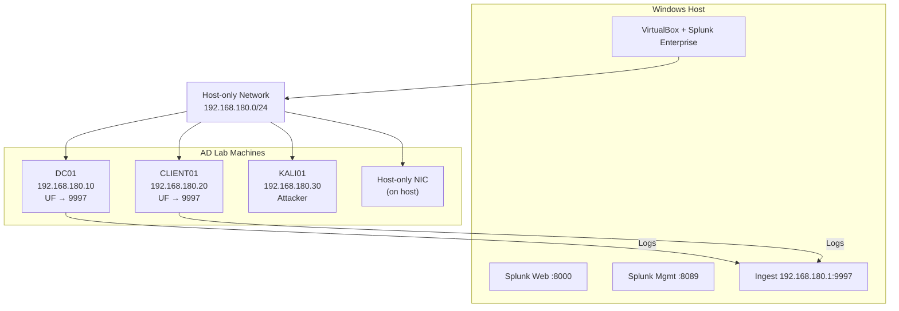

# ActiveDoom Lab Architecture

This document describes the ActiveDoom hybrid attack-and-detection lab architecture.

## Network Segment

- Lab subnet: `192.168.180.0/24`
- Splunk host listener: `192.168.180.1:9997`
- DC01: `192.168.180.10`
- CLIENT01: `192.168.180.20`
- KALI01: `192.168.180.30`

## Diagram

## Data Flow

1. `DC01` and `CLIENT01` generate Windows security telemetry.
2. Splunk Universal Forwarder ships events to host Splunk on port `9997`.
3. Splunk dashboards and SPL detections identify suspicious authentication behavior.
4. Attack simulation scripts emulate brute-force and valid-account activity for detection validation.
