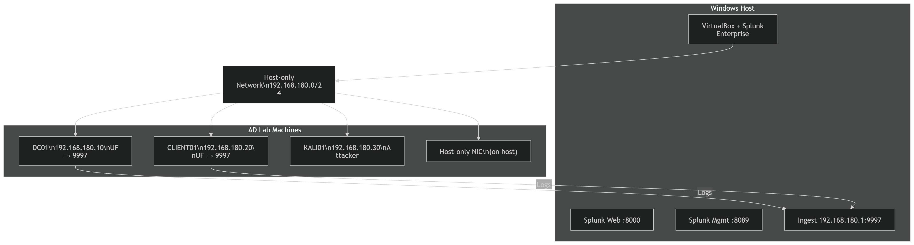
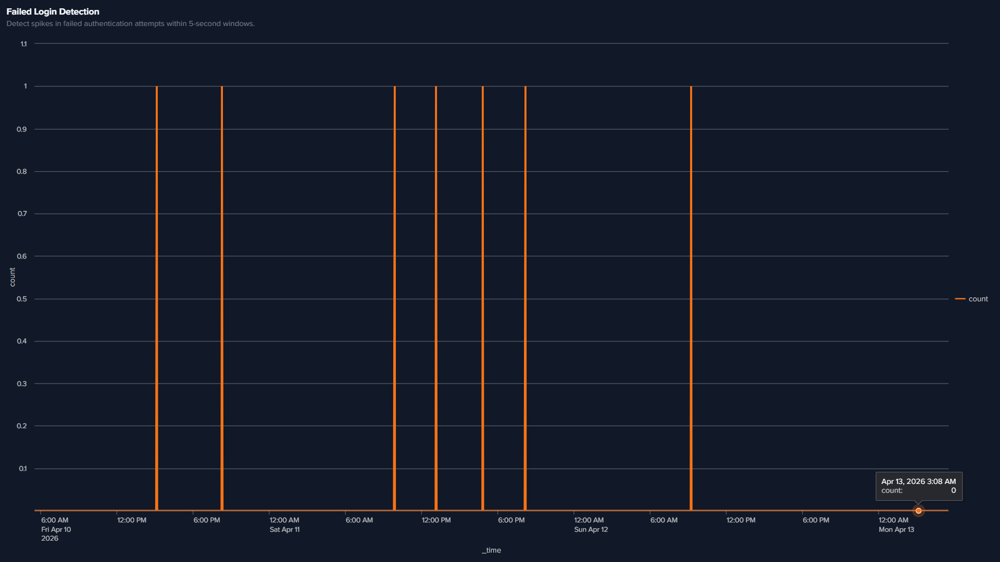
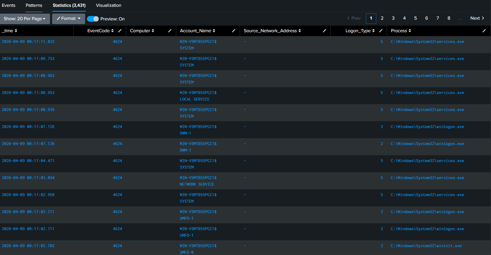
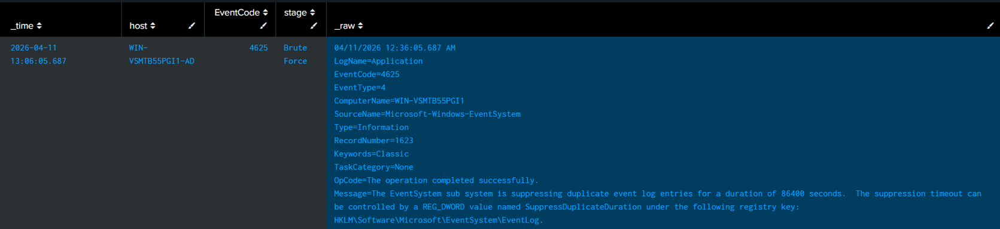
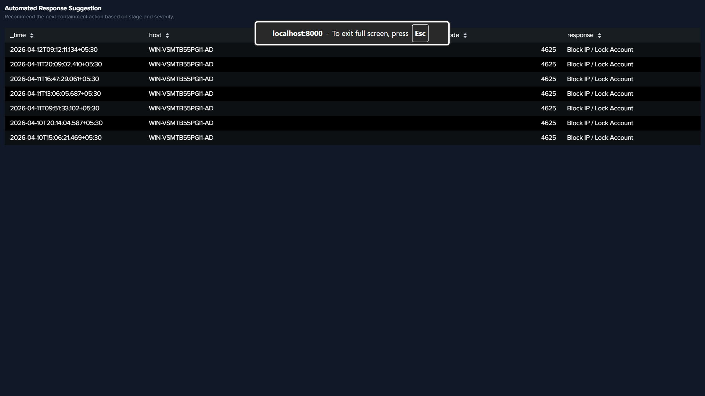

# ActiveDoom Final Report

## Executive Summary

ActiveDoom is an Active Directory attack-and-detection lab demonstrating how SOC analysts can detect authentication abuse through Windows event telemetry in Splunk.

## Environment Snapshot

- Subnet: `192.168.180.0/24`
- Systems: `DC01`, `CLIENT01`, `KALI01`
- SIEM: Splunk Enterprise (host)
- Data Source: Windows Security Events (`4624`, `4625`)

## Scenarios Executed

1. Failed authentication burst simulation
2. Valid account authentication simulation
3. Detection validation through SPL searches

## Detection Outcomes

- Event ID `4625` successfully captured failed login bursts.
- Event ID `4624` captured successful authentications.
- Threshold query identified brute-force-like patterns.

## MITRE ATT&CK Mapping

- `T1110 - Brute Force` mapped to Event ID `4625`
- `T1078 - Valid Accounts` mapped to Event ID `4624`

## Evidence Placeholders

Use the screenshots below as the report evidence set:

- `screenshots/architecture-diagram.png` - architecture diagram
- `screenshots/failed-logins-4625.png` - failed login search results
- `screenshots/success-logins-4624.png` - successful login search results
- `screenshots/bruteforce-timeline.png` - brute-force detection timeline
- `screenshots/alert-triggered.png` - alert/severity evidence

### Embedded Slots

## Lessons Learned

- Authentication telemetry is highly effective for baseline detection engineering.
- Controlled simulation scripts improve repeatability and confidence in detections.
- Proper network/DNS/time configuration is critical to avoid false negatives.

## Next Iteration Plan

- Integrate Wazuh for endpoint-level correlation.
- Add automated data generation pipeline for continuous testing.
- Expand detections for lateral movement and privilege escalation.
